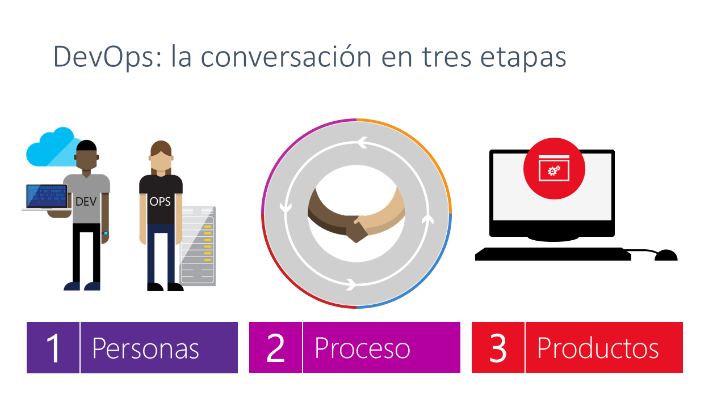
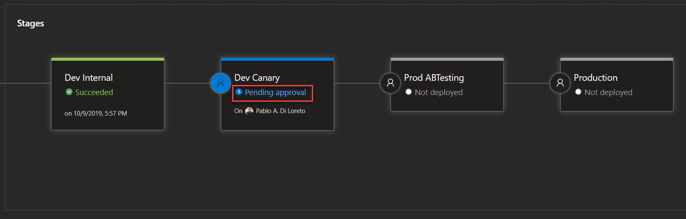
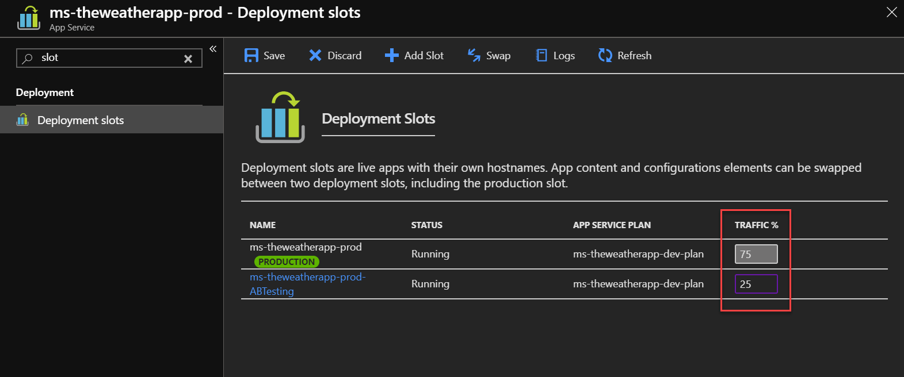

# Deploying your application faster and safer

La implementación de aplicaciones ha cambiado drásticamente a lo largo de los años: desde aquellas tediosas tareas manuales reemplazadas por rutinas con guiones, hasta hoy donde aún más fácil con los servicios en la nube.

Este repositorio tiene material correspondiente a una charla que se dió por primera vez en el año 2019, y que fue evolucionando. ¿Cuál es el foco? Profundizar en la automatización y la implementación continua de aplicaciones con los Servicios de Microsoft Azure. Comenzaremos con lo básico, discutiendo las operaciones automatizadas que los desarrolladores controlan (DevOps) como las pruebas A/B y las aprobaciones de despliegue automatizadas. Luego lo llevaremos por completo a la nube utilizando el servicio "Azure DevOps Projects", mostrándote cómo puede automatizar la implementación de una aplicación web.

## Material de Consulta

El material que se trata en la sesión es:

* [Presentacion en PPTX](ALG-MS_Deploying-your-application-faster-and-safer.pptx)
* [TheWeatherApp](https://github.com/pablodiloreto/the-weather-app)

Esta demo tratará sobre los siguientes temas:

* [Azure Pipelines](https://azure.microsoft.com/en-au/services/devops/pipelines/)
* [Azure Pipelines App for GitHub](https://github.com/marketplace/azure-pipelines)
* [Azure DevOps Deployment Gates](https://docs.microsoft.com/en-us/azure/devops/pipelines/release/approvals/gates)
* [Azure App Service Deployment Slots](https://docs.microsoft.com/en-us/azure/app-service/web-sites-staged-publishing)

También brindamos los siguientes links adicionales:

* [Azure DevOps Documentation](https://docs.microsoft.com/en-us/azure/devops/)
* [DevOps Resource Center](https://docs.microsoft.com/en-us/azure/devops/learn/)

Este material fue generado por [Pablo Ariel Di Loreto](https://www.linkedin.com/in/pablodiloreto/) que en el año 2019 era el CTO de Algeiba Dev, empresa del [Grupo Algeiba](https://www.algeiba.com).

Este material fue generado sobre la idea de Microsoft que figura en [este repositorio](https://github.com/microsoft/IgniteTheTour/tree/main/DEV%20-%20Building%20your%20Applications%20for%20the%20Cloud/DEV20).

# DISCLAIMER

IMPORTANTE: En esta charla verás que la demo tiene dos ambientes ficticios: desarrollo y producción. De ninguna manera recomendamos que en el "mundo real" las implementaciones se realicen directamente a producción sin un ambiente de Testing / QA propiamente dicho. En este caso, y solo por optimizar la presentación en 60 minutos, realizamos un salto desde Desarrollo a un ambiente "Productivo".

Por otro lado, verás que en la solución Node.js te encontrarás con API Key de un servicio de meteorología. De ninguna manera recomendamos que en el "mundo real" expongas en tu código fuente credenciales de servicios. Existen otras opciones más seguras como Key Vault y técnicas de desarrollo que evitarán que tengas estas exposiciones de información sensible.

# Tutorial de Demostración

## Instalación

* Esta demo necesita de un navegador web y VSCode.
* Comenzar realizando un fork y un local clone de [https://github.com/pablodiloreto/the-weather-app](https://github.com/pablodiloreto/the-weather-app)
* Es necesario tener creado un sitio web (Azure App Service) con dos slots: Production (viene por default) & A/B Testing.
* Es necesario tener una API Key válida para el servicio de openweathermap.org: es un proceso muy simple, se requiere generar un usuario y password y solicitar una API Key. La aprobación de la API Key (que se pueda utilizar en tu app) lleva unas horas. Mientras tanto podrás utilizar la API Key que ya figura en la aplicación (no hay riesgo sobre su uso, pero tiene límites diarios).

## Script de Sesión

### Diapositivas

Estoy muy contento de compartir esta sesión con ustedes para charlar de un tema emocionante: "DevOps". Algunos de ustedes, quizás, pensarán: "¡qué bueno! vamos a hablar y ver demos sobre DevOps" y otros, quizás, comentarán "¿¡otra vez DevOps!? ¡si son solo pipelines de CI / CD!".

Puedo darle todas las razones y puedo sacar cuadros y gráficos para intentar convencerlos de que DevOps es un gran aliado para el negocio. Pero quería mostrarte un cortometraje que realmente personifica la diferencia de antes y después de DevOps con las nuevas herramientas que hoy tenemos disponible.

¡Y POR ESO tenemos que hacer DevOps! NO como solíamos hacerlo. Todos los servidores con martillos intentan que nuestro código se implemente una vez al año. ¡Necesitamos ser una máquina bien engrasada como ese equipo de boxes! Continuamente entregando valor!

Ahora he mencionado mucho DevOps, pero qué es exactamente DevOps. Apuesto a que si le pregunto a 10 personas en esta sala qué es DevOps, obtendremos 10 respuestas diferentes. Y no digo que la definición de nadie más esté mal. Pero para enmarcar esta conversación que estamos teniendo, déjame darte la definición de Microsoft de DevOps.

Desde Microsoft y Algeiba, DevOps es algo muy específico. Devops es la unión de personas, procesos y productos para permitir la entrega continua de valor a nuestros usuarios finales. Ahora note que dije eso con mucho cuidado. No dije continuamente entregar el código. Porque, ¿qué nos dará eso? Solo piples y montones de código que no son útiles para nuestros usuarios finales. Y fíjense, ni siquiera dije que continuamente entregaran características. Porque podríamos estar entregando característica tras característica, pero si no estamos entregando valor, ¡solo estamos perdiendo el tiempo!

¿Ahora por qué es esto importante? ¿Por qué debería importarnos DevOps? La velocidad de los negocios hoy es TAN rápida, que debemos adoptar las mejores prácticas de DevOps solo para mantenernos al día. Si no lo hacemos, nuestros competidores tienen o adoptarán las mejores prácticas de DevOps. Y si lo hacen, nos innovarán y nos volverán obsoletos. Y nadie quiere quedar obsoleto.

La forma de construir aplicaciones y entregar valor a los usuarios ha cambiado. Miren esta comparativa tecnológica y de negocio entre el pasado y el presente.

Para implementar DevOps con éxito, consideramos debemos atacar tres pilares al escribir software: personas, procesos y productos.

Para la parte de personas, ese es el cambio más difícil de hacer. A veces requiere cambios culturales que deben tener lugar en la organización. Donde todos, de arriba hacia abajo, se vuelven hiperfocos en la entrega continua de valor. No quiero escuchar, bueno, así es como siempre hacemos las cosas de cualquiera. Todos deben enfocarse en entregar continuamente valor.

Un equipo de trabajo modelo y sus roles son los que vemos en pantalla: todos trabajando en pos de entregar valor a nuestros clientes, ya sea internos o externos.

Para el proceso, necesitamos tener uno que nos permita interactuar lo suficientemente rápido, pero aún así entregar código de calidad suficientemente alto. ¿Entonces que significa eso? Necesito poder planificar mis sprints, y debo poder ingresar y salir de mi código mientras sigo el trabajo que estoy haciendo. ¿Y mientras reviso el código dentro y fuera? Las construcciones necesitan comenzar. Las pruebas automatizadas deben ejecutarse. Los análisis de seguridad deben realizarse. Y si la construcción es buena, un sistema automatizado necesita recoger mis bits y desplegarlos en mi Dev, QA, UAT hasta la producción.

¿Y por qué esto necesita ser automatizado? ¡Potencialmente, esto puede suceder muchas veces al día! Por lo tanto, debemos asegurarnos de que el proceso sea consistente y repetible. Cada vez que el reloj funciona. Y una vez que el código llega a producción, no termina ahí. Aún necesitamos poder monitorear nuestro código en producción. Necesitamos saber cosas como si mi aplicación está activa o inactiva, si mi aplicación funciona bien y qué están haciendo realmente los usuarios en mi aplicación. Debido a que las respuestas a esas preguntas me avisan si estoy entregando valor a mis usuarios finales. Y si lo estoy, podemos duplicar ese tipo de actividades en el próximo sprint. Y si no lo somos, podemos priorizar rápidamente nuestro trabajo atrasado y corregir el curso.

Ahora todo esto requiere los productos y herramientas adecuados para ayudar a habilitar todo esto. Por lo tanto, necesitamos herramientas que nos permitan seguir nuestro trabajo a lo largo de nuestro sprint. Necesitamos sistemas de control de fuente que puedan corrolar nuestro trabajo con nuestros registros. Necesitamos sistemas automatizados de compilación y lanzamiento que puedan basarse en cada revisión, ejecutar todas nuestras pruebas unitarias y automatizar la implementación hasta la producción. Y necesitamos sistemas para monitorear nuestra aplicación en producción.

Allá afuera en el mundo, hay todo tipo de herramientas que hacen estas cosas. Y Azure es un sistema abierto, lo que significa que puede seguir usando todas las herramientas de DevOps con las que está más familiarizado.

Sin embargo, puede reemplazar TODOS con un solo producto. Azure DevOps.

Azure DevOps es, literalmente, todo lo que necesita para tomar una idea y convertir esa idea en un software que funcione en manos de sus usuarios finales, para CUALQUIER lenguaje dirigido a CUALQUIER plataforma. Azure DevOps es un conjunto de 5 productos separados que funcionan INCREÍBLEMENTE juntos. Hay un producto de seguimiento de elementos de trabajo llamado Azure Boards, donde puede realizar un seguimiento de cualquier unidad de trabajo en su proyecto de software con herramientas visuales para ayudarlo a administrar todo su trabajo. Hay Azure Pipelines, donde puede construir sus canalizaciones de CI / CD para cualquier idioma dirigido a cualquier plataforma. Hay Azure Repos donde puede alojar su propio repositorio de Git o un sistema de control de versiones centralizado. Hay Planes de prueba de Azure para que pueda crear, planificar y ejecutar todas sus pruebas manuales. Y finalmente está Azure Artifacts, donde puede hospedar sus sistemas de administración de paquetes, donde sean paquetes nuget, maven o incluso genéricos.

(Ir recorriendo cada uno de los servicios).

En la sesión de hoy, nos concentraremos en Azure Pipelines, donde implementaremos nuestro código de manera más rápida y segura.

### Demo

#### Creación de Azure DevOps Project

Creamos un nuevo proyecto de tipo "DevOps Project" desde la consola de Microsoft Azure.

Elegimos "Bring your own code" como opción:

Elegimos la opción de repositorio "GitHub", en caso que no estemos logueados nos va a requerir inicio de sesión.
Asimismo, seleccionamos el repositorio (fork) del proyecto indicado más arriba en el inicio del tutorial.
Por último elegimos el branch "master".

Vamos a seleccionar que nuestra aplicación NO ES dockerizada.
Vamos a seleccionar el runtime "Node.js".

Seleccionaremos la opción de "Linux Web App".
En "Application Settings" vamos a indicar los siguientes datos:
* Path to application code: src/theweatherapp-nodejs
* Version: Node.js 10.1
* Task Runner: None
* Startup Command: node server.js

Completaremos las últimas opciones para poder crear el "DevOps Project":
* Project name: indicar un nombre, por ejemplo "demo-TheWeatherApp-xxxx".
* Azure DevOps Organization: especificar una pre-existente o ver "Additional settings" más adelante.
* Subscription: elegir una suscripción (se requiere una).
* Web app name: indicaremos un nombre que se relacione con "Dev".
* Location & Pricing tier: seleccionar según elección propia.

En opciones avanzadas desplegaremos más opciones:
* Resource Group: según elección personal.
* Application Insights Location: según elección personal.
* Pricint tier: según elección personal.
* DevOps Organization: como dijimos antes, en caso de no tener ninguna organización aquí se podrá crear una.

Le damos clic en "Done" y aguardamos a la creación.

#### Muestra de la App

Mientras esperamos que el DevOps Project de Azure se cree, vamos a mostrar la app en un entorno local con VSCode.

#### Muestra de Primer Despliegue y Pipelines

Mostraremos el primer despliegue realizado en la home de DevOps Projects:

Mostraremos el primer despliegue y pipeline ejecutado correctamente desde Azure DevOps Pipelines:

#### Creación de Slot para Dev Canary

Vamos a generar un "Slot" en Azure App Service para poder brindar mayor flexibilidad en el despliegue.
A este slot lo llamaremos "canary" y lo clonaremos de la app de "production".

Nota: es importante mencionar que el nombre "Canary" viene de una estrategia de despliegue llamada con el mismo nombre. En nuestro caso ficticio, estamos habilitando a supuestos "usuarios" a poder disfrutar de despliegues de tipo "Canary" del equipo de Desarrollo interno de la empresa.

El restulado será este:

#### Modificación de Pipeline de Despliegue

Ahora vamos a modificar el pipeline de despliegue para reflejar un "ambiente" más en la solución a desplegar.
Ingresamos al pipeline de CD y lo editamos:

Clonamos el "Stage" de Dev:

Ingresamos al nuevo "Stage" que se llamará "Copy of dev" y lo editamos con el nombre "Dev Canary":

Ingresamos al "Job" y "Tasks" para editar las tareas:

Allí editamos el paso "Deploy Azure App Service" y seleccionamos desplegarlos a un "Slot" y elegimos el slot "Canary":

Elegiremos una pre-condición antes de avanzar. Seleccionaremos "Pre-deployment conditions":

Modificaremos la opción "Pre-deployment approvals" y elegiremos quién lo aprueba:

Salvamos y dejamos un comentario sobre nuestra modificación:

Cambiamos el nombre al stage "Dev" por "Dev Internal" para reflejar una situación probable en nuestro ambiente.

#### Modificación de la App para segundo despliegue y Análisis de Pipelines

Realizamos una modificación en nuestra app (por ejemplo cambiar de grados centígrados a Celsius). Ingresamos a "server.js" y modificamos la siguiente linea:

Comiteamos, pusheamos a master y aguardamos los cambios en el pipeline.
Pronto veremos que la tarea se está ejecutando:

Y también veremos cómo se agrega el "Stage" al DevOps Project:

Mostraremos detalles del Pipeline:

Y de su log:

Una vez finalizada la tarea, podremos ver el cambio en el sitio de "Dev Internal". No obstante, aún quedará pendiente la aprobación para pasar al ambiente (slot con URL única) de "Dev Canary":

El sitio web con la URL original se encuentra funcional.

#### Aprobación de Pipeline para Dev Canary

Aprobaremos el stage "Dev Canary":

Y veremos cómo se inicia el deploy. Minutos más tarde veremos la URL de slot "Canary" con el sitio web ejecutandose:

#### Preparación de A/B Testing en Producción con Azure App Service Deployment Slots

Para esto se utilizará el App Service pre-existente (que hemos creado al inicio) que tiene dos slots: "Production" y "A/B Testing".

Vamos a modificar el Pipeline de Despliegue para poder "desplegar" a estos dos Slots, con un orden específico habilitando pruebas de A/B Testing.

Primero, vamos a editar el Pipeline de CD, creando un nuevo Stage. Es importante tener seleccionado el último stage antes de agregar uno nuevo, así el mismo se genera posteriormente al anterior:

Vamos a elegir "Azure App Service deployment" como template:

Vamos a ingresar el nombre de "Prod ABTesting".

Luego vamos a ingresar a los Jobs y nos encontraremos con la siguiente pantalla:

Deberás completar los parámetros como se muestran a continuación, pero con tu Suscripción y con tu App service name. Lo que sí deberás considerar tal cual figura en la imagen es el "Startup command":

Con respecto a la pantalla anterior, es importante mencionar que el "Azure Subscription" puede variar de nombre según tus configuraciones, como así también el "Service Connection" que se genera. En caso de la imagen que mostramos anteriormente, el nombre de la conexión tiene el surfijo "-dev". No deberás prestar atención a esos detalles.

Luego ingresarás a "Deploy Azure App Service" y elegir que el despliegue es a un Slot, como así también completar información faltante del "Runtime Stack":

Luego de salvar las configuraciones anteriores, llegó el momento de configurar el "Pre-deployment condition". Como hemos hecho en pasos anteriores, seleccionarás "Pre-deployment approvals" e ingresarás tu usuario (a modo de demo):

#### Preparación del slot "Production" como último paso del Pipeline

Realizaremos una clonación del Stage "Prod ABTesting" para poder agilizar la creación del último paso:

Ingresaremos el nombre "Production":

Ingresaremos a los Jobs / Tasks y comprobaremos las opciones tal como figuran en pantalla (recordá que la Suscripción y App service name pueden cambiar según tus preferencias):

Salvaremos e ingresaremos a "Deploy Azure App Service". Allí destildaremos la opción "Deploy to Slot or App Service Environment". Esto hará que nuestro despliegue vaya al slot de Producción, y no al de ABTesting. Dejaremos las opciones de "Pre-deployment conditions" tal cual se han clonado. Ahora si, salvaremos el Pipeline.

#### Ejecución manual de Pipeline de tipo Build

Vamos a ejecutar manualmente el Pipeline de tipo "Build" para generar un ciclo completo de despliegue de la solución entre todos los stages:

El proceso tardará unos minutos, y en cada paso donde exista una "pre-aprobación" vamos a tener que aprobarlo. Mientras tanto es importante poder charlar con el público haciendo un review mental y atendiendo a consultas que puedan surgir. Remarcaremos en todo momento los "Pending approvals":

Revisaremos, además, que todos los ambientes (URLs) funcionen.

#### Configuración de A/B Testing y Modificación final

Vamos a hacer la modificación en los slots de la app "-prod" para realmente generar un A/B Testing. Para ello vamos a ir a los slots configurados. Allí vamos a configurar que un 25% del tráfico sea enviado al slot "ABTesting":

Modificaremos nuestra app para volver a Grados Centígrados, configurando nuevamente la llamada a la API e indicando que sea "metric":

Realizaremos el commit y push correspondiente, y esto lanzará nuevamente el proceso de despliegue y lo aprobaremos en cada stage *a excepción* del Production: esta vez nuestro cambio llegará hasta ABTesting (es decir haremos un Reject en Production):

De esta manera podremos solicitar al público a que ingrese a la URL de Production y verá, como aleatoriamente, algunos son enviados a la aplicación que responde en Farenheit y otros a la que responde con Grados Centigrados.

### Diapositivas

Volvemos a las diapositivas para hacer un cierre y conclusiones.

# Crédito de este material

Este material fue generado por [Pablo Ariel Di Loreto](https://www.linkedin.com/in/pablodiloreto/) que es el Service Delivery Manager de Algeiba Dev, empresa del [Grupo Algeiba](https://www.algeiba.com).

Este material fue generado sobre la idea de Microsoft que figura en el siguiente repositorio: https://github.com/microsoft/IgniteTheTour/tree/master/DEV%20-%20Building%20your%20Applications%20for%20the%20Cloud/DEV20
