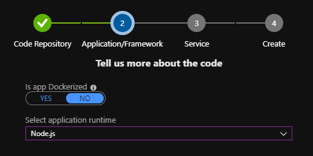

# Deploying your application faster and safer

La implementación de aplicaciones ha cambiado drásticamente a lo largo de los años: desde aquellas tediosas tareas manuales reemplazadas por rutinas con guiones, hasta hoy donde aún más fácil con los servicios en la nube.

En esta charla, profundizaremos en la automatización y la implementación continua de aplicaciones con los Servicios de Microsoft Azure. Comenzaremos con lo básico, discutiendo las operaciones automatizadas que los desarrolladores controlan (DevOps) como las pruebas A / B y las aprobaciones de despliegue automatizadas. Luego lo llevaremos por completo a la nube utilizando el servicio "Azure DevOps Projects", mostrándote cómo puede automatizar la implementación de una aplicación web.

## Material de Consulta

Esta demo tratará sobre los siguientes temas:

* [Azure Pipelines](https://azure.microsoft.com/en-au/services/devops/pipelines/)
* [Azure Pipelines App for GitHub](https://github.com/marketplace/azure-pipelines)
* [Azure DevOps Deployment Gates](https://docs.microsoft.com/en-us/azure/devops/pipelines/release/approvals/gates)
* [Azure App Service Deployment Slots](https://docs.microsoft.com/en-us/azure/app-service/web-sites-staged-publishing)

También brindamos los siguientes links adicionales:

* [Azure DevOps Documentation](https://docs.microsoft.com/en-us/azure/devops/)
* [DevOps Resource Center](https://docs.microsoft.com/en-us/azure/devops/learn/)

Para conocer créditos de este material, ir al pie de página.

# Tutorial de Demostración

## Instalación

* Esta demo necesita de un navegador web y VSCode.
* Comenzar realizando un fork y un local clone de [https://github.com/pablodiloreto/the-weather-app](https://github.com/pablodiloreto/the-weather-app)
* Es necesario tener creado un sitio web (Azure App Service) con dos slots: Production & A/B Testing.

## Script de Sesión

### Diapositivas

Estoy muy contento de compartir esta sesión con ustedes para charlar de un tema emocionante: "DevOps". Algunos de ustedes, quizás, pensarán: "¡qué bueno! vamos a hablar y ver demos sobre DevOps" y otros, quizás, comentarán "¿¡otra vez DevOps!? ¡si son solo pipelines de CI / CD!".

Puedo darle todas las razones y puedo sacar cuadros y gráficos para intentar convencerlos de que DevOps es un gran aliado para el negocio. Pero quería mostrarte un cortometraje que realmente personifica la diferencia de antes y después de DevOps con las nuevas herramientas que hoy tenemos disponible.

[Imagen]

¡Y POR ESO tenemos que hacer DevOps! NO como solíamos hacerlo. Todos los servidores con martillos intentan que nuestro código se implemente una vez al año. ¡Necesitamos ser una máquina bien engrasada como ese equipo de boxes! Continuamente entregando valor!

[Imagen]

Ahora he mencionado mucho DevOps, pero qué es exactamente DevOps. Apuesto a que si le pregunto a 10 personas en esta sala qué es DevOps, obtendremos 10 respuestas diferentes. Y no digo que la definición de nadie más esté mal. Pero para enmarcar esta conversación que estamos teniendo, déjame darte la definición de Microsoft de DevOps.

[Imagen]

En Microsoft, DevOps es algo muy específico. Devops es la unión de personas, procesos y productos para permitir la entrega continua de valor a nuestros usuarios finales. Ahora note que dije eso con mucho cuidado. No dije continuamente entregar el código. Porque, ¿qué nos dará eso? Solo piples y montones de código que no son útiles para nuestros usuarios finales. Y fíjense, ni siquiera dije que continuamente entregaran características. Porque podríamos estar entregando característica tras característica, pero si no estamos entregando valor, ¡solo estamos perdiendo el tiempo!

[Imagen los procesos llevan tiempo]

¿Ahora por qué es esto importante? ¿Por qué debería importarnos DevOps? La velocidad de los negocios hoy es TAN rápida, que debemos adoptar las mejores prácticas de DevOps solo para mantenernos al día. Si no lo hacemos, nuestros competidores tienen o adoptarán las mejores prácticas de DevOps. Y si lo hacen, nos innovarán y nos volverán obsoletos. Y nadie quiere quedar obsoleto.

[Imagen Comparativa]

La forma de construir aplicaciones y entregar valor a los usuarios ha cambiado. Miren esta comparativa tecnológica y de negocio entre el pasado y el presente.

[Imagen Personas, Procesos y Productos]

Para implementar DevOps con éxito, consideramos debemos atacar tres pilares al escribir software: personas, procesos y productos.

[Imagen Personas]

Para la parte de personas, ese es el cambio más difícil de hacer. A veces requiere cambios culturales que deben tener lugar en la organización. Donde todos, de arriba hacia abajo, se vuelven hiperfocos en la entrega continua de valor. No quiero escuchar, bueno, así es como siempre hacemos las cosas de cualquiera. Todos deben enfocarse en entregar continuamente valor.

[Imagen Equipo Trabajo]

Comentario sobre Equipo.

[Imagen Proceso]

Para el proceso, necesitamos tener uno que nos permita interactuar lo suficientemente rápido, pero aún así entregar código de calidad suficientemente alto. ¿Entonces que significa eso? Necesito poder planificar mis sprints, y debo poder ingresar y salir de mi código mientras sigo el trabajo que estoy haciendo. ¿Y mientras reviso el código dentro y fuera? Las construcciones necesitan comenzar. Las pruebas automatizadas deben ejecutarse. Los análisis de seguridad deben realizarse. Y si la construcción es buena, un sistema automatizado necesita recoger mis bits y desplegarlos en mi Dev, QA, UAT hasta la producción.

¿Y por qué esto necesita ser automatizado? ¡Potencialmente, esto puede suceder muchas veces al día! Por lo tanto, debemos asegurarnos de que el proceso sea consistente y repetible. Cada vez que el reloj funciona. Y una vez que el código llega a producción, no termina ahí. Aún necesitamos poder monitorear nuestro código en producción. Necesitamos saber cosas como si mi aplicación está activa o inactiva, si mi aplicación funciona bien y qué están haciendo realmente los usuarios en mi aplicación. Debido a que las respuestas a esas preguntas me avisan si estoy entregando valor a mis usuarios finales. Y si lo estoy, podemos duplicar ese tipo de actividades en el próximo sprint. Y si no lo somos, podemos priorizar rápidamente nuestro trabajo atrasado y corregir el curso.

[Imagen de Productos y Herramientas]

Ahora todo esto requiere los productos y herramientas adecuados para ayudar a habilitar todo esto. Por lo tanto, necesitamos herramientas que nos permitan seguir nuestro trabajo a lo largo de nuestro sprint. Necesitamos sistemas de control de fuente que puedan corrolar nuestro trabajo con nuestros registros. Necesitamos sistemas automatizados de compilación y lanzamiento que puedan basarse en cada revisión, ejecutar todas nuestras pruebas unitarias y automatizar la implementación hasta la producción. Y necesitamos sistemas para monitorear nuestra aplicación en producción.

[Imagen de Soluciones]

Allá afuera en el mundo, hay todo tipo de herramientas que hacen estas cosas. Y Azure es un sistema abierto, lo que significa que puede seguir usando todas las herramientas de DevOps con las que está más familiarizado.

[Imagen de Soluciones Azure]

Sin embargo, puede reemplazar TODOS con un solo producto. Azure DevOps.

[Imagen y Diapos de Servicios Azure DevOps]

Azure DevOps es, literalmente, todo lo que necesita para tomar una idea y convertir esa idea en un software que funcione en manos de sus usuarios finales, para CUALQUIER lenguaje dirigido a CUALQUIER plataforma. Azure DevOps es un conjunto de 5 productos separados que funcionan INCREÍBLEMENTE juntos. Hay un producto de seguimiento de elementos de trabajo llamado Azure Boards, donde puede realizar un seguimiento de cualquier unidad de trabajo en su proyecto de software con herramientas visuales para ayudarlo a administrar todo su trabajo. Hay Azure Pipelines, donde puede construir sus canalizaciones de CI / CD para cualquier idioma dirigido a cualquier plataforma. Hay Azure Repos donde puede alojar su propio repositorio de Git o un sistema de control de versiones centralizado. Hay Planes de prueba de Azure para que pueda crear, planificar y ejecutar todas sus pruebas manuales. Y finalmente está Azure Artifacts, donde puede hospedar sus sistemas de administración de paquetes, donde sean paquetes nuget, maven o incluso genéricos.

[Pasaje entre diapositivas]

En la sesión de hoy, nos concentraremos en Azure Pipelines, donde implementaremos nuestro código de manera más rápida y segura.

### Demo

#### Creación de Azure DevOps Project

Creamos un nuevo proyecto de tipo "DevOps Project" desde la consola de Microsoft Azure.

Elegimos "Bring your own code" como opción:

Elegimos la opción de repositorio "GitHub", en caso que no estemos logueados nos va a requerir inicio de sesión.
Asimismo, seleccionamos el repositorio (fork) del proyecto indicado más arriba en el inicio del tutorial.
Por último elegimos el branch "master".

Vamos a seleccionar que nuestra aplicación NO ES dockerizada.
Vamos a seleccionar el runtime "Node.js".

Seleccionaremos la opción de "Linux Web App".
En "Application Settings" vamos a indicar los siguientes datos:
* Path to application code: src/theweatherapp-nodejs
* Version: Node.js 10.1
* Task Runner: None
* Startup Command: node server.js

Completaremos las últimas opciones para poder crear el "DevOps Project":
* Project name: indicar un nombre, por ejemplo "demo-TheWeatherApp-xxxx".
* Azure DevOps Organization: especificar una pre-existente o ver "Additional settings" más adelante.
* Subscription: elegir una suscripción (se requiere una).
* Web app name: indicaremos un nombre que se relacione con "Dev".
* Location & Pricing tier: seleccionar según elección propia.

En opciones avanzadas desplegaremos más opciones:
* Resource Group: según elección personal.
* Application Insights Location: según elección personal.
* Pricint tier: según elección personal.
* DevOps Organization: como dijimos antes, en caso de no tener ninguna organización aquí se podrá crear una.

Le damos clic en "Done" y aguardamos a la creación.

#### Muestra de la App

Mientras esperamos que el DevOps Project de Azure se cree, vamos a mostrar la app en un entorno local con VSCode.

#### Muestra de Primer Despliegue y Pipelines

Mostraremos el primer despliegue realizado en la home de DevOps Projects:

Mostraremos el primer despliegue y pipeline ejecutado correctamente desde Azure DevOps Pipelines:

#### Creación de Slot para Dev Canary

Vamos a generar un "Slot" en Azure App Service para poder brindar mayor flexibilidad en el despliegue.
A este slot lo llamaremos "canary" y lo clonaremos de la app de "production":

El restulado será este:

#### Modificación de Pipeline de Despliegue

Ahora vamos a modificar el pipeline de despliegue para reflejar un "ambiente" más en la solución a desplegar.
Ingresamos al pipeline de CD y lo editamos:

Clonamos el "Stage" de Dev:

Ingresamos al nuevo "Stage" que se llamará "Copy of dev" y lo editamos con el nombre "Dev Canary":

Ingresamos al "Job" y "Tasks" para editar las tareas:

Allí editamos el paso "Deploy Azure App Service" y seleccionamos desplegarlos a un "Slot" y elegimos el slot "Canary":

Elegiremos una pre-condición antes de avanzar. Seleccionaremos "Pre-deployment conditions":

Modificaremos la opción "Pre-deployment approvals" y elegiremos quién lo aprueba:

Salvamos y dejamos un comentario sobre nuestra modificación:

Cambiamos el nombre al stage "Dev" por "Dev Internal" para reflejar una situación probable en nuestro ambiente.

#### Modificación de la App para segundo despliegue y Análisis de Pipelines

Realizamos una modificación en nuestra app (por ejemplo cambiar de grados centígrados a Celsius). Ingresamos a "server.js" y modificamos la siguiente linea:

Comiteamos, pusheamos a master y aguardamos los cambios en el pipeline.
Pronto veremos que la tarea se está ejecutando:

Y también veremos cómo se agrega el "Stage" al DevOps Project:

Mostraremos detalles del Pipeline:

Y de su log:

Una vez finalizada la tarea, podremos ver el cambio en el sitio de "Dev Internal". No obstante, aún quedará pendiente la aprobación para pasar al ambiente (slot con URL única) de "Dev Canary":

El sitio web con la URL original se encuentra funcional.

#### Aprobación de Pipeline para Dev Canary

Aprobaremos el stage "Dev Canary":

Y veremos cómo se inicia el deploy.

Minutos más tarde veremos la URL de slot "Canary" con el sitio web ejecutandose:

#### Generación de ambiente de Producción para A/B Testing

Contenido pendiente.

#### Modificación de Pipeline para Producción

Contenido pendiente.

#### Despliegue y A/B Testing

Contenido pendiente.

#### Monitoreo

Contenido pendiente.

### Diapositivas

Cierre de Diapositivas.

# Crédito de este material

Este material fue generado por [Pablo Ariel Di Loreto](https://www.linkedin.com/in/pablodiloreto/) que es el Service Delivery Manager de Algeiba Dev, empresa del [Grupo Algeiba](https://www.algeiba.com).

Este material fue generado sobre la idea de Microsoft que figura en el siguiente repositorio: https://github.com/microsoft/IgniteTheTour/tree/master/DEV%20-%20Building%20your%20Applications%20for%20the%20Cloud/DEV20
